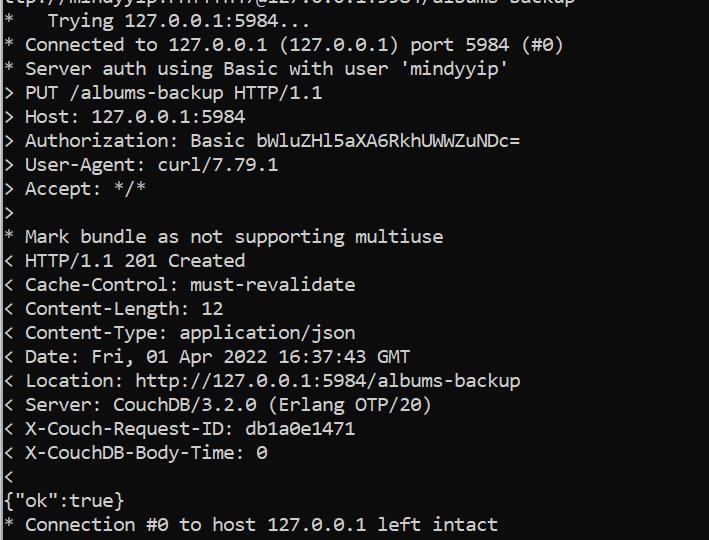

# Lab 10 Report

## Checkpoint 0

[Project Blog Updates](https://github.com/mindyyip/lab3/wiki)

## Checkpoint 1

## Checkpoint 2

### List of Databases

### Creating More Databases

### Deleting Plankton Database

### Resulting Databases

### Mango Queries

### Triggering Replication

## Checkpoint 3

### Album Database

### Album Backup Database

### UIUD

### Documents

### Revisions

### Attachments

### Replication 

## Checkpoint 4

### cURL to select movies from a given year

### cURL to select movies whose titles come after "L"

### Creating an index

### cURL "L" without warnings

